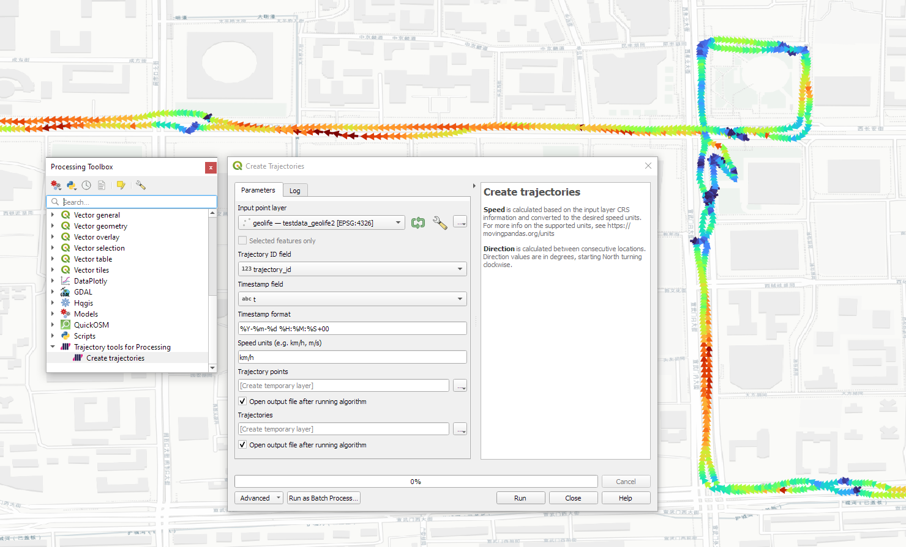
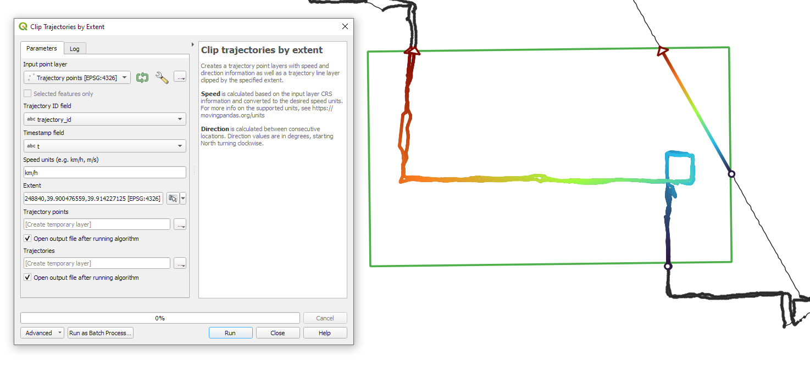

# QGIS Processing Trajectools

The Trajectools plugin adds trajectory analysis algorithms to the QGIS Processing toolbox. 


## Requirements

Trajectools requires [MovingPandas](https://github.com/movingpandas/movingpandas) (a Python library for movement data analysis) and optionally integrates [scikit-mobility](https://scikit-mobility.github.io/scikit-mobility/) and [gtfs_functions](https://github.com/Bondify/gtfs_functions). 

The recommended way to install these dependencies is through conda/mamba:

```
(base) conda create -n qgis -c conda-forge python=3.9 
(base) conda activate qgis
(qgis) mamba install -c conda-forge qgis movingpandas scikit-mobility
(qgis) pip install gtfs_functions
```

(More details: https://anitagraser.com/2023/01/21/pyqgis-jupyter-notebooks-on-windows-using-conda/)

The Trajectools plugin can be installed directly in QGIS using the built-in Plugin Manager:


**Figure 1: QGIS Plugin Manager with Trajectools plugin installed.**


## Examples

The individual Trajectools algorithms are flexible and modular and can therefore be used on a wide array on input datasets, including, for example, the open [Microsoft Geolife dataset](http://research.microsoft.com/en-us/downloads/b16d359d-d164-469e-9fd4-daa38f2b2e13/) a [sample](https://github.com/emeralds-horizon/trajectools-qgis/tree/main/sample_data) of which is included in the plugin repo:



